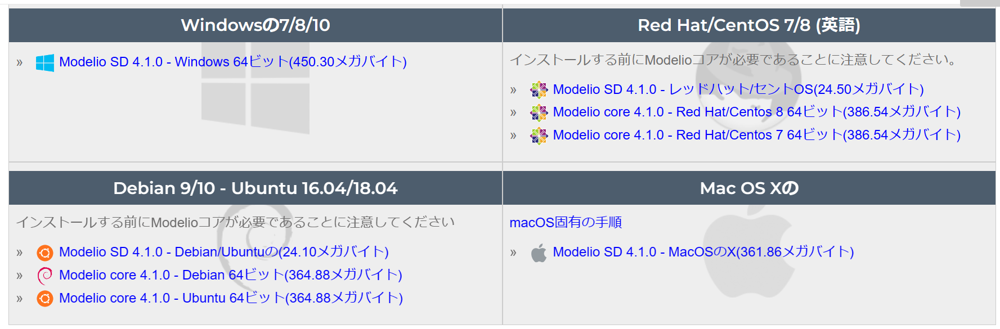

##環境のセットアップ方法のメモ

###■Modelioについて

####参考にしたURL

####ログインIDの作成方法
**・ログインIDを使う場面**：
・追加のAddonをダウンロードするとき
・追加のModelio SDをダウンロードするとき

####Modelioのインストール方法

####PluginModuleのインストール方法

####Modelio SDのインストール方法
**・なぜ使う？**
Modelio SD(**s**oftware **D**evelopment)には、JavaやC++のコード生成機能がある。
・参考サイト
[Modelio SD](https://www.modeliosoft.com/en/products/modelio-sd-software-designers.html)
[Modelio C++ Designer module](https://www.modeliosoft.com/en/modules/cpp-designer.html)

このコード生成機能を使用して、システム設計（主に、アクティビティ図）をコード生成して、コードでテストを実行する。
ModelioはExecutabule SysMLには対応していないので、一度コードにしてから動的テストを実行する必要がある。

**・インストール**
下記サイトにアクセスし、インストーラーをダウンロードする。
インストールには、ModelioのログインIDとパスワードが必要になる。
10間のお試しライセンスのみ使用する。
必要になったタイミングで、インストールしコード生成機能を使用する。

①下記のURLにアクセスする。
https://www.modeliosoft.com/en/download/download-products.html#modelio_sd
②Modelioを使用している環境のインストーラーを選択する。

③ログインIDとパスワードを入力して、ダウンロードする。

※画像は、[https://www.modeliosoft.com/en/](https://www.modeliosoft.com/en/)から引用

###■umbrello

####参考にしたURL

####umblleroのインストール方法

###■Scilabについて

###■その他のツールについて

####他のSysMLが使えるツール
**実行不可能なSysMLデザインツール**
★OSS
・Drawio

・PlantUML

・Papyrus

★有償ツール
結構ある・・・

**実行可能なSysMLデザインツール**
私の知る限り、有償ツールしかない。
・Dassult製 『Cameo System Modeler』

・SaprkxSystems製 『Enterprise Architect』

・IBM製 『Rhapsody』