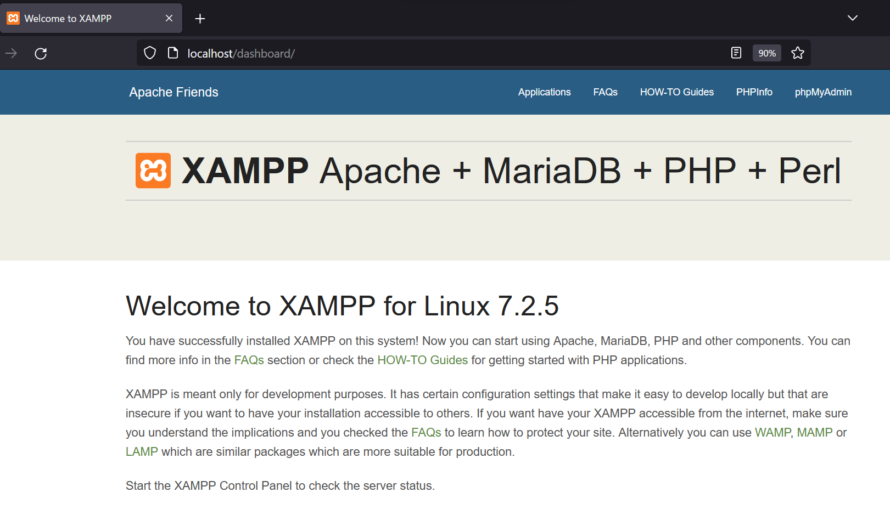
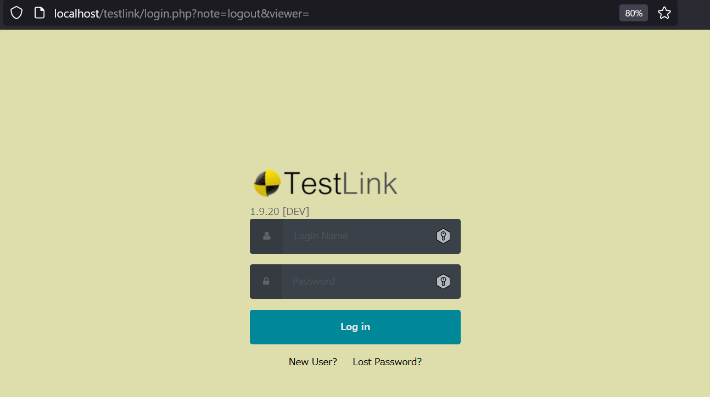

##Testlink環境構築

####Dockerの設定
TestlinkのインストールにDockerコンテナがあったので、利用してみる。

DockerのWSL2での利用するための、設定の仕方


####Testlinkのインストール
Bingの回答の通りにTestlinkをインストールする。

>・TestlinkのWSL2へのインストール
>もちろんです！ **TestLink** を **Docker** コンテナとして **WSL 2 (Windows Subsystem for Linux 2)** 上で展開する方法を以下に示します。
>1. **前提条件**:
    - WSL 2がインストールされていること。
    - Docker Desktop for Windowsがインストールされていること。
    - WSL 2ベースのエンジンが有効になっていること。
>2. **Docker Desktop for Windowsの設定**:
    - Docker Desktop for Windowsを起動し、WSL 2ベースのエンジンを有効にします。これにより、同じコンピューター上でLinuxとWindowsの両方のコンテナを実行できます¹.
>3. **TestLinkのDockerコンテナの起動**:
    - WSL 2のターミナルで以下のコマンドを実行して、TestLinkのDockerコンテナを起動します:
        ```bash
        docker run -d -p 80:80 --name testlink imtnd/testlink
        ```
    - ブラウザで `http://localhost` にアクセスすると、TestLinkが表示されます。
>これでTestLinkがWSL 2上でDockerコンテナとして実行されています。詳細な設定やカスタマイズはTestLinkの公式ドキュメントを参照してください。¹⁵⁶
>ソース: Bing との会話 2023/12/19
(1) WSL での Docker コンテナーの概要 | Microsoft Learn. https://learn.microsoft.com/ja-jp/windows/wsl/tutorials/wsl-containers.
(2) TestLinkのdocker imageをdockerhubにアップロードしてみた - Qiita. https://qiita.com/imtnd/items/a58a707db08c3710d963.
(3) undefined. http://xxx.xxx.xxx.xxx/testlink/.
(4) Get started with Docker remote containers on WSL 2. https://github.com/MicrosoftDocs/WSL/blob/main/WSL/tutorials/wsl-containers.md.
(5) Developing Docker-Powered Apps on Windows with WSL 2. https://www.docker.com/blog/developing-docker-windows-app-wsl2/.
(6) Running your first Docker container in WSL 2 - Medium. https://levelup.gitconnected.com/running-your-first-docker-container-in-wsl-2-22c71b24038.
(7) テスト工程の管理をするツール、TestLinkについて #テスト - Qiita. https://qiita.com/mima_ita/items/ed56fb1da1e340d397b9.
(8) Dockerfileをよくわからずに使っているエンジニア、全員集合 .... https://qiita.com/Toyo_m/items/5713f85a9d5ff8d9cc0d.
(9) 【2019年版】Docker Bitnami/TestLink を設定する - Qiita. https://qiita.com/shimizumasaru/items/6c7b3f55a2dd63d5252b.
(10) undefined. https://docs.bitnami.com/virtual-machine/faq/get-started/enable-ssh/.

####自分の環境でやってみた
Dockerイメージの展開などは、回答通りにできた。
ただ、イメージファイルが古くVer1.19.14_padawanだった。
下記画像からインストール作業を始められるが、最新版（1.19.20_Raijin）を使用したいので、これ以上は進めない。


####1.19.20_Raijinをインストールする

・WSL2にGitをインストールする
Gitのインストールの仕方は、以下のコマンドで行う。

~~~
>sudo apt update
>sudo apt install git
~~~

・WSL2にTestlinkをインストールする
下記サイトに倣って、ダウンロードとインストールを行う。
https://codesandbox.io/p/github/ashel1806/testlink_docker/main

うまくできなかった・・・
HTTP 502エラーでインストレーションを行うことができなかった。

また、下記サイトを参考にMysql5.7、PHP8の環境を整えてチャレンジしてみた。

[How to install the TestLink 1.9.20 on Ubuntu 22.04](https://medium.com/@samueltcsantos/installing-the-teslink-in-ubuntu-fca5b01257a5)

こちらも同様に、HTTP 502エラーでインストレーションを行うことができなかった。

####なぜインストールできなかったか？
推測になるが、Php8ではないかと思われる。
TestlinkのGithubリポジトリを見ると、最新のFIｘ版の[testlink_1_9_20_fixed](https://github.com/TestLinkOpenSourceTRMS/testlink-code.git)のコメントがPHP8 compatibilityと記載がある。
PHP8で環境でも、インストールできると思った。
Dockerコンテナ、マニュアル、Xampp等を試したが、すべてインストレーションのページより先がHTTP 502エラーになってしまった。
（不慣れなので、自分の環境構築が下手なだけかもしれない）

PHP8ではなく、PHP7で環境を準備する。

####Xampp7.xを使用して、Testlinkをインストール

**WSL2へのXamppのインストール方法**
このサイトを参考に欲しいバージョンのPHPを含む、XAMPPをインストールする。
[WSL2のUbuntuにXAMPPをインストールして動かす](https://shigeo-t.hatenablog.com/entry/2021/03/11/050000)

・XAMPPについて

>XAMPP とは？
XAMPP は最も人気のある PHP 開発環境です
XAMPP は、完全に無償で MariaDB、PHP、および Perl を含んだ、簡単にインストールできる Apache ディストリビューションです。XAMPP オープン ソース パッケージは、インストールと利用が非常に簡単できるよう設定されています。
[「XAMPP Apache + MariaDB + PHP + Perl」](https://www.apachefriends.org/jp/index.html)より引用

[Apache Friends](https://www.apachefriends.org/jp/download.html)のサイトでは、PHP8のインストーラしかないので、「[その他のダウンロード](http://sourceforge.net/projects/xampp/files/)」から過去バージョンのダウンロードサイトへアクセスする。


(https://www.apachefriends.org/jp/download.html より引用)

「その他のダウンロード」から、[Sourceforgeのサイト](https://sourceforge.net/projects/xampp/files/)に飛ぶので、「[XAMPP Linux](https://sourceforge.net/projects/xampp/files/XAMPP%20Linux/)」を選択する。


(https://sourceforge.net/projects/xampp/files/XAMPP%20Linux/ より引用)

7.x.x（PHP7）を選び、WSLにインストールする。
※7.4.xなどを選択すると、MariaDBがMariaDB 10.4.22になってしまい、Teslinkの要件を外れてしまうので注意


（https://github.com/TestLinkOpenSourceTRMS/testlink-code/tree/testlink_1_9_20_fixed/ より引用）

今回は、XAMPP7.2.25をインストールすることにした。
★バージョン情報
https://www.apachefriends.org/blog/new_xampp_20180511.html
★ダウンロードサイト
https://sourceforge.net/projects/xampp/files/XAMPP%20Linux/7.2.5/

・XAMPPのインストール
下記サイトを見ながら、XAMPPをインストールする。
[WSL2のUbuntuにXAMPPをインストールして動かす](https://shigeo-t.hatenablog.com/entry/2021/03/11/050000)

~~~
root@hoge:/home/hogehoge# wget https://sourceforge.net/projects/xampp/files/XAMPP%20Linux/7.2.5/xampp-linux-x64-7.2.5-0-installer.run
root@hoge:/home/hogehoge# ./xampp-linux-x64-7.2.5-0-installer.run
~~~

インストールのGUIが起動するので、GUIを操作してインストールする。


「Next」を押下する。


XAMPP Core FilesとXAMPP Developer Filesにチェックを入れて、「Next」を押下する。


「Next」を押下する。


「Next」を押下する。


「Next」を押下する。
インストールが始まる。


インストールが無事に終了し「Finish」を押下すると、XAMPPのメニュー画面が開かれる。


「Manage Service」のタブを開き、「Start All」を押下する。


ブラウザからlocalhostでアクセスすると、ダッシュボードが開く。


右上のphpMyAdminを開くと、下記が開く。


ここまで、できるとXAMPPが正常にWSL2にインストールされる！

**XAMPPのセキュリティ設定**
XAMPP FAQsに記載があるセキュリティ設定を行う。
初期設定で、MysqやphpMyAdminにパスワード設定がされていないので、設定を行う。

以下のサイトを参考にした。
[UbuntuにLAMPP(XAMPPのLinux版)をインストールする](https://lil.la/archives/4324)
[Linux よくある質問](http://intranet.iesc.gov.ar/dashboard/jp/faq.html)

>デフォルトの設定では、XAMPPはパスワードが設定されていません。そして、他人がアクセスする環境で、この設定のままXAMPPを実行するのはお勧めできません。セキュリティチェックを開始するために、rootユーザとして次のコマンドを実行してください。
>~~~
>sudo /opt/lampp/lampp security
>~~~
>画面に次のようなダイアログが表示されます。
>XAMPP: Quick security check...
>XAMPP: MySQL is accessable via network.
>XAMPP: Normaly that's not recommended. Do you want me to turn it off? [yes] yes
>XAMPP: Turned off.
>XAMPP: Stopping MySQL...
>XAMPP: Starting MySQL...
>XAMPP: The MySQL/phpMyAdmin user pma has no password set!!!
>XAMPP: Do you want to set a password? [yes] yes
>XAMPP: Password: ******（任意のパスワード）
>XAMPP: Password (again): ******
>XAMPP: Setting new MySQL pma password.
>XAMPP: Setting phpMyAdmin's pma password to the new one.
>XAMPP: MySQL has no root passwort set!!!
>XAMPP: Do you want to set a password? [yes] yes
>XAMPP: Write the passworde somewhere down to make sure you won't forget it!!!
>XAMPP: Password: ******（任意のパスワード）
>XAMPP: Password (again): ******
>XAMPP: Setting new MySQL root password.
>XAMPP: Setting phpMyAdmin's root password to the new one.
>XAMPP: The FTP password for user 'nobody' is still set to 'lampp'.
>XAMPP: Do you want to change the password? [yes] yes
>XAMPP: Password: ******（任意のパスワード）
>XAMPP: Password (again): ******
>XAMPP: Reload ProFTPD...
>XAMPP: Done.

後ほど、Teslinkインストール時に、MySQLのadminログインについて聞かれるときに、設定したパスワードを使用する。

**Testlinkのインストール方法**
Testlinkのインストール方法は、下記サイトに従って行う。
[TestLink - Installation](https://www.tutorialspoint.com/testlink/testlink_installation.htm)

**Step1** - Testlink-1.9.20-fixedのクローン
~~~
>sudo git clone https://github.com/TestLinkOpenSourceTRMS/testlink-code.git
~~~

クローンが完了すると、「testlink-code」というディレクトリがクローンされる。


**Step2** - Testlinkフォルダの場所変更
「Testlink-code」のディレクトリ名を「testlink」に変更する。
/opt/lampp/htdocsに「testlink」ディレクトリを移動する。

~~~
>sudo mv testlink-code testlink
>sudo mv testlink /opt/lampp/htdocs
~~~

htdocsのディレクトリ内に移動する。


**Step3** - Configファイルの編集
XAMPPの環境上にTestlinkをインストールするので、Configファイル（config.inc.php）に記載されているデフォルト情報を修正する。

nanoエディターを使用して、configファイルの情報を更新する。
~~~
>cd /opt/lampp/htdocs/testlink
>sudo nano config.inc.php
~~~

config.inc.phpの下記の箇所を変更する。
~~~
//$tlCfg→log_path = ‘/var/testlink/logs/’; /* unix example */
//下記のように修正する
$tlCfg→log_path = ‘/opt/lampp/htdocs/testlink/logs/’;
~~~
~~~
$g_repositoryPath = ‘D:/xampp/htdocs/testlink/upload area/’; /* unix example */
//下記のように修正する
$g_repositoryPath = ‘/opt/lampp/htdocs/testlink/upload area/’;
~~~

もし必要があれば、権限を付与する。
~~~
>sudo chmod 777 config.inc.php
~~~

**Step4** - localhost/testlinkにアクセス
ブラウザからlocalhost/testlinkにアクセスする。
アクセスすると下記のページが開く。
インストレーションに関して、以下のyoutubeを参考にした。
<iframe width="560" height="315" src="https://www.youtube.com/embed/sIWr4-75-6A?si=JqPPaAmRXvgSMHJT" title="YouTube video player" frameborder="0" allow="accelerometer; autoplay; clipboard-write; encrypted-media; gyroscope; picture-in-picture; web-share" allowfullscreen></iframe>


動画を参考にしつつ、インストールを行っていく。


「New installation」をクリックして、インストールを始める。

ライセンスについて聞かれるので、「I agree to the terms set out in this license.」にチェックを入れて「Continue」を押す。


WSL２に準備した環境のチェックが行われます。


WSL2に準備した環境が問題なければ、PHPやデータベース、Read/Writeの権限のところに「OK」と表示される。
OKが表示されたら、「Continue」を押下する。


各設定項目は、下記に設定する。
Database Type: **MySQL/MariaDB(5.6+/10.+)**
Database host: **localhost**
Database names: **testlink**


Table prefixは**空**のまま、設定する。


以下の項目はXamppのMySQLのrootユーザーの設定を登録する。
**Database admin login** : root
**Database admin password** : 設定済みのパスワード

任意のDB名とパスワードを設定する。
存在しないDBなら、新規に作成してくれる。
（既に作成している場合は、既存の情報を登録する）
**TestLink DB login** : 任意
**TestLink DB password** : 任意

「Process Testlink Setup!」を押下する。

**Step5** - インストレーション開始
DBの設定を終えると、以下の画面が表示される。


localhost/testlinkにアクセスすると、ログイン画面が表示される。


最初にログインする際は、admin/adminでログインする。
別のadminユーザーを作成して、adminユーザーを無効化する。
（SMTPサーバーの設定はやらないので、新規にAdminユーザーを作る方が楽）

ログインした後のTestlink
